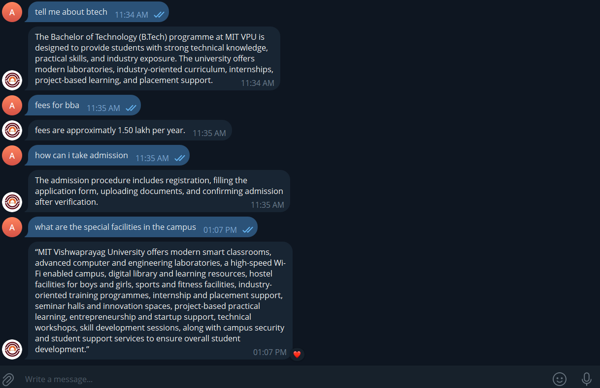
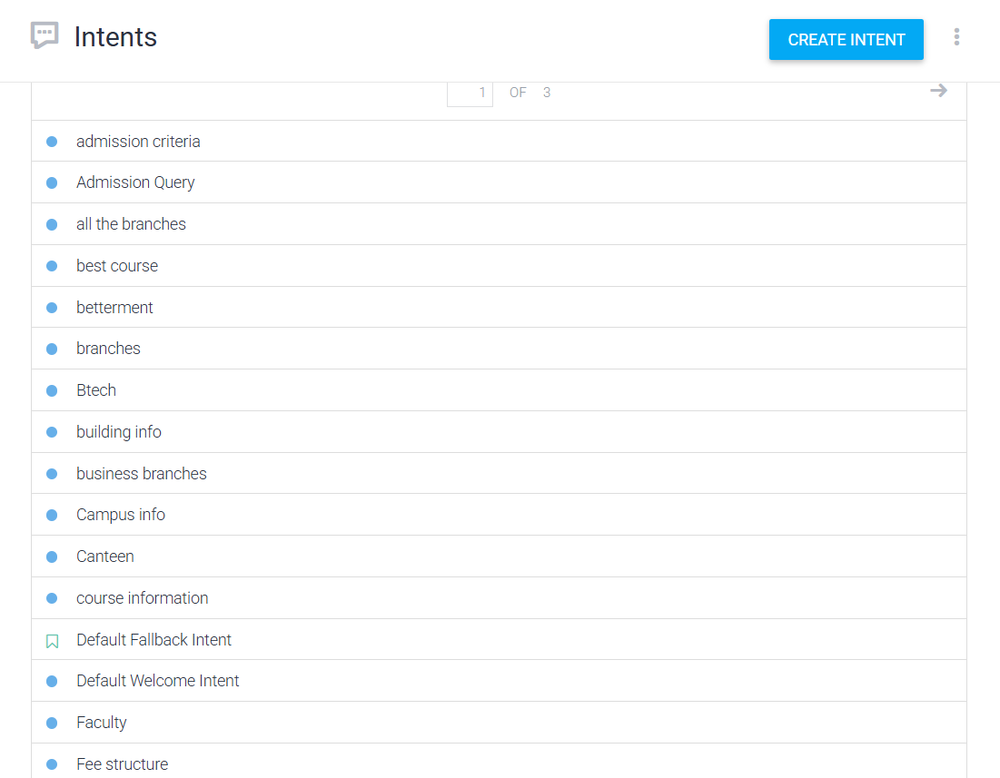
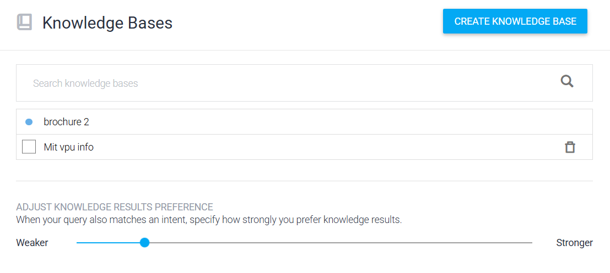

  

# MIT VPU Chatbot

## 🌐 Live Demo

(https://telegram.me/vpuassistantbot)

## Project Overview
This project is an AI-based university chatbot developed using Dialogflow for MIT Vishwaprayag University, Solapur.

## 📸 Project Screenshots

### 💬 Telegram Chatbot

### 🤖 Dialogflow Intents

### 📚 Knowledge Base

The chatbot helps students by answering queries related to:
- Admissions
- Courses
- Fees structure
- Scholarships
- Placements
- Internships
- Campus facilities

## Technologies Used
- Dialogflow
- Natural Language Processing (NLP)
- Telegram Bot Integration

## Features
- Automated student support
- FAQ handling
- Instant responses
- Knowledge base integration
- User-friendly interaction

## 👥 Team Contributions

### Abhay Amane
- Intent Design
- Training Phrases
- Response Development
- GitHub Documentation

### Rahule Dhale
- Data Collection
- Knowledge Base Preparation

### Shruti Kale
- Testing
- Validation
- Error Handling

 ## 📊 Project Statistics

- 15+ Intents
- 100+ Training Phrases
- Knowledge Base Enabled
- Telegram Integration
- 24/7 Student Support

 ## 🚀 Future Enhancements

- Mobile Application Integration
- Generative AI (GenAI) Integration
- Voice-Based Interaction
- Multi-language Support
- Student Portal Integration

## Project Files
- `Mit_vpu_chatbot.zip` → Exported Dialogflow chatbot project

## Conclusion
The project demonstrates how AI and NLP can be used to automate university support services and improve student interaction.
